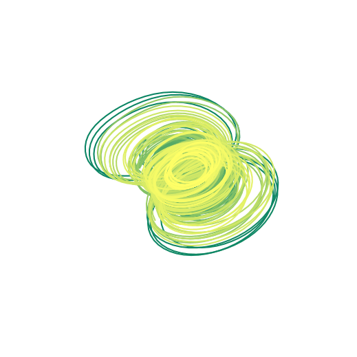

# QNODE: Learning quantum dynamics using latent neural ODEs

**Learning quantum dynamics using latent neural ODEs**

*Matthew Choi, Daniel Flam-Spepherd, Thi Ha Kyaw, Alán Aspuru-Guzik*

https://journals.aps.org/pra/abstract/10.1103/PhysRevA.105.042403

https://arxiv.org/abs/2110.10721

## Samples
<p align="center">


</p>

## Latent Dynamics
<p align="center">


</p>

## Interpolations
<p align="center">


</p>

## Prerequisites

| command | min. version |
|:-:|:-:|
| torchdiffeq  | 0.0.1 |
| numpy  | 1.17.4  |
| Pytorch  | 1.4.0 |
| QuTip | 4.6.2  |
| matplotlib  | 3.4.3  |
| scikit-learn  | 0.23.1  |
| imageio  | 2.6.1  |

## Training Models

run 
```
python3 train.py
```

To train a model with different hyperparameters:
| command | argstype | meaning |
|:-:|:-:|:-:|
| --seed  | int | the torch and numpy random seed  |
| --epochs  | int | numbers of iterations the model will run |
| --type | str | either the `open` or `closed` dataset  |
| --obs_dim  | int | input dimensions  |
| --rnn_nhidden  | int | rnn layer size  |
| --nhidden  | int | decoder layer size  |
| --latent_dim  | int | latent space size |
| --lr | float | learning rate  |

Example: 
```
python3 train.py --seed 1 --epochs 5000 --lr 5e-3 --type closed
```

## Generating Results

run 
```
./create_plots.sh
```
<sub><sup>Note: you might have to run `chmod +x create_plots.sh`</sup></sub>
